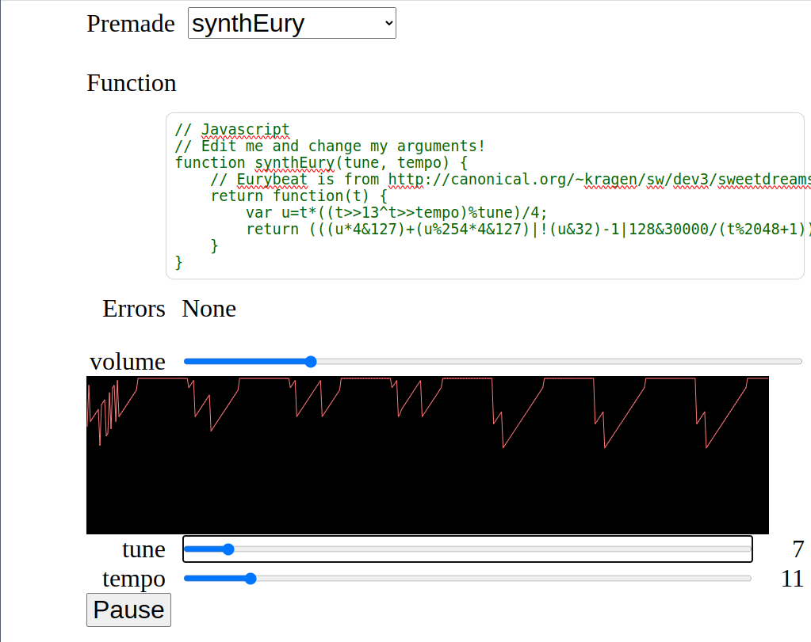

## Hack-A-Day 14: Synth

This is a little synth made by [za3k](https://za3k.com) and [Kragen Javier Sitaker](http://canonical.org/~kragen/) as part of [hack-a-day](https://za3k.com/hackaday).
You can play [bytebeat music](http://canonical.org/~kragen/bytebeat) in it.

You can interact with a demo of it [here](https://za3k.github.io/ha3k-14-synth/).

Have fun!
